# 🏗️ Arquitectura Completa del Sistema - webDocumentador

**Versión:** 1.0  
**Fecha:** 10 de febrero de 2026

---

## 📋 Índice

1. [Visión General](#visión-general)
2. [Arquitectura del Sistema](#arquitectura-del-sistema)
3. [Flujo Completo del Proyecto](#flujo-completo-del-proyecto)
4. [Sistema de Prefijos](#sistema-de-prefijos)
5. [Sistema de Numeración Global](#sistema-de-numeración-global)
6. [Componentes Clave](#componentes-clave)

---

## 🎯 Visión General

**webDocumentador** es una aplicación web para la documentación de proyectos mineros que permite:

- Cargar datos de centros poblados desde archivos JSON
- Crear grupos dinámicos AISD (Comunidades Campesinas) y AISI (Distritos)
- Documentar cada grupo con secciones específicas
- Generar documentos exportables (PDF/JSON)
- Aislar datos entre grupos usando prefijos
- Numerar imágenes y tablas globalmente

---

## 🏛️ Arquitectura del Sistema

### Diagrama de Arquitectura General

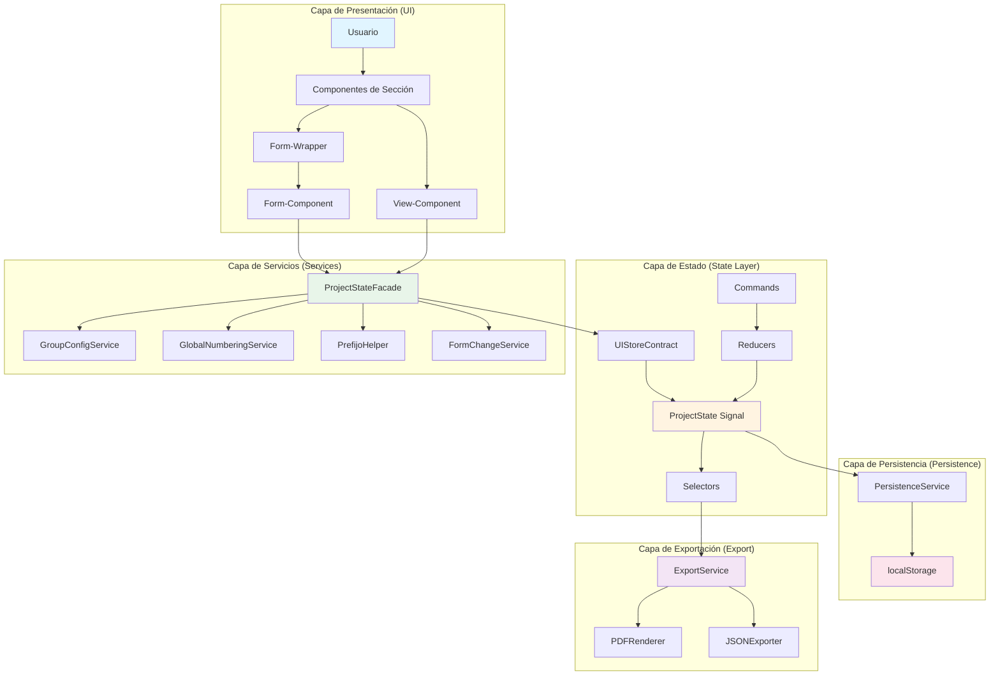

### Diagrama de Capas Detallado

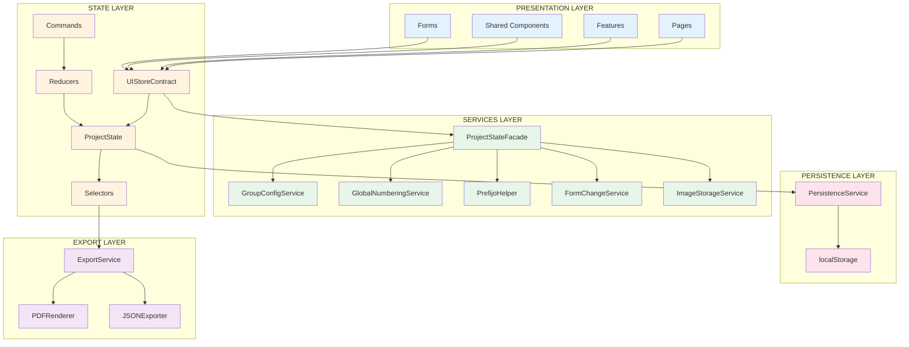

---

## 🔄 Flujo Completo del Proyecto

### Flujo de Usuario - Desde el Inicio hasta la Exportación

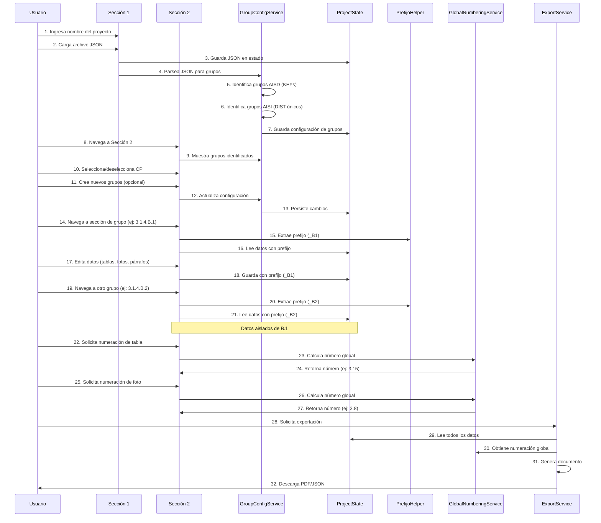

### Flujo de Datos - Escritura

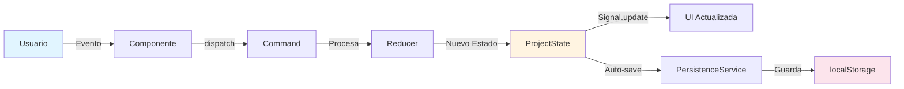

### Flujo de Datos - Lectura


---

## 🔐 Sistema de Prefijos

### Flujo de Aislamiento de Datos

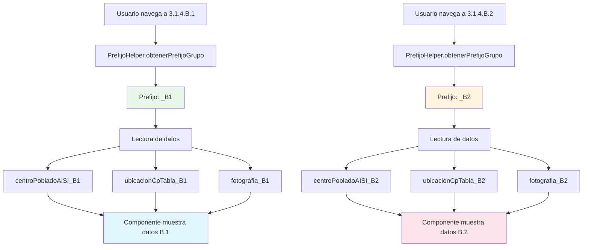

### Diagrama de Aislamiento entre Grupos

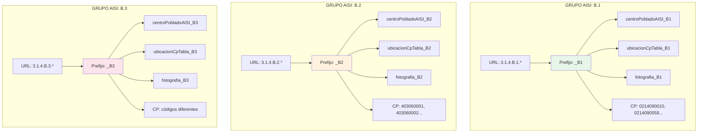

---

## 🔢 Sistema de Numeración Global

### Flujo de Numeración de Tablas

```mermaid
graph TB
    A[Sección solicita número de tabla] --> B[GlobalNumberingService]
    B --> C{Tipo de sección?}
    C -->|Sección base| D[Calcula offset base]
    C -->|Grupo AISD| E[Calcula offset AISD]
    C -->|Grupo AISI| F[Calcula offset AISI]
    
    E --> G[Offset = (grupoIndex - 1) * 36]
    F --> H[Offset = (numAISD * 36) + (grupoIndex - 1) * 22]
    
    D --> I[Número = 3 + offset + tablaIndex]
    G --> I
    H --> I
    
    I --> J[Retorna número global]
    J --> K[Componente muestra Cuadro 3.XX]
    
    style B fill:#e8f5e9
    style I fill:#fff4e1
    style K fill:#e1f5ff
```

### Flujo de Numeración de Fotos

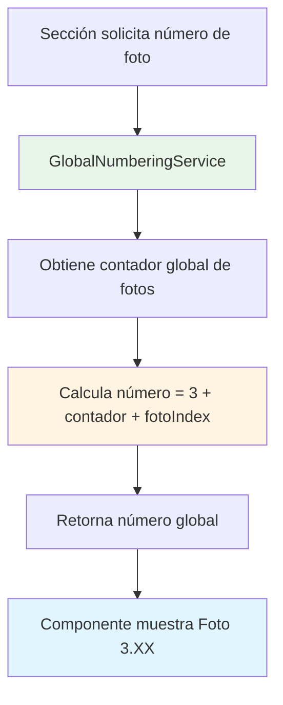

### Ejemplo de Numeración Global

```mermaid
graph TB
    subgraph "SECCIONES BASE"
        A1[Sección 1]
        A2[Sección 2]
        A3[Sección 3]
    end
    
    subgraph "GRUPO AISD: A.1"
        B1[A.1.1]
        B2[A.1.2]
        B3[A.1.3]
    end
    
    subgraph "GRUPO AISD: A.2"
        C1[A.2.1]
        C2[A.2.2]
        C3[A.2.3]
    end
    
    subgraph "GRUPO AISI: B.1"
        D1[B.1.1]
        D2[B.1.2]
        D3[B.1.3]
    end
    
    subgraph "GRUPO AISI: B.2"
        E1[B.2.1]
        E2[B.2.2]
        E3[B.2.3]
    end
    
    A1 -->|Tablas: 3.1-3.5| F[Contador global]
    A2 -->|Tablas: 3.6-3.10| F
    A3 -->|Tablas: 3.11-3.15| F
    B1 -->|Tablas: 3.16-3.20| F
    B2 -->|Tablas: 3.21-3.25| F
    B3 -->|Tablas: 3.26-3.30| F
    C1 -->|Tablas: 3.31-3.35| F
    C2 -->|Tablas: 3.36-3.40| F
    C3 -->|Tablas: 3.41-3.45| F
    D1 -->|Tablas: 3.46-3.50| F
    D2 -->|Tablas: 3.51-3.55| F
    D3 -->|Tablas: 3.56-3.60| F
    E1 -->|Tablas: 3.61-3.65| F
    E2 -->|Tablas: 3.66-3.70| F
    E3 -->|Tablas: 3.71-3.75| F
    
    style F fill:#fff4e1
```

---

## 🧩 Componentes Clave

### Estructura de Componentes

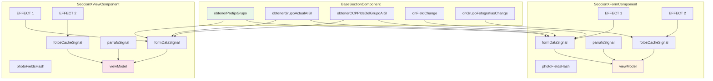

### Servicios Principales

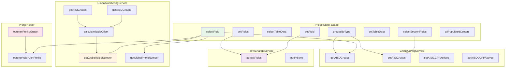

---

## 📊 Resumen del Flujo Completo

### Desde el Inicio hasta la Exportación

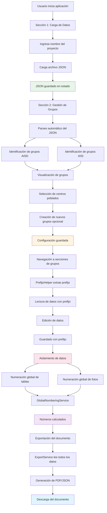

---

## 🎯 Objetivo Final del Proyecto

El objetivo final de **webDocumentador** es proporcionar una plataforma completa para:

1. **Cargar y procesar datos** de centros poblados desde archivos JSON
2. **Organizar datos** en grupos dinámicos AISD (Comunidades Campesinas) y AISI (Distritos)
3. **Documentar cada grupo** con secciones específicas (tablas, fotos, párrafos)
4. **Aislar datos** entre grupos usando prefijos dinámicos
5. **Numerar elementos** (imágenes y tablas) globalmente en todo el documento
6. **Exportar documentos** en formatos PDF y JSON

### Resultado Esperado

```
┌─────────────────────────────────────────────────────────────────┐
│                    DOCUMENTO FINAL                              │
│                                                                 │
│  Capítulo 3: Línea Base Social                                 │
│                                                                 │
│  3.1 - Primera imagen del documento                            │
│  3.2 - Segunda imagen del documento                            │
│  ...                                                            │
│                                                                 │
│  Cuadro 3.1 - Primera tabla del documento                      │
│  Cuadro 3.2 - Segunda tabla del documento                      │
│  ...                                                            │
│                                                                 │
│  GRUPO AISD: A.1 - CAHUACHO                                    │
│  ├── A.1.1 - Descripción                                       │
│  ├── A.1.2 - Datos demográficos                                │
│  ├── ...                                                        │
│  └── A.1.20 - Última subsección                                │
│                                                                 │
│  GRUPO AISD: A.2 - SAN PEDRO                                   │
│  ├── A.2.1 - Descripción                                       │
│  ├── ...                                                        │
│  └── A.2.20 - Última subsección                                │
│                                                                 │
│  GRUPO AISI: B.1 - DISTRITO 1                                  │
│  ├── B.1.1 - Descripción                                       │
│  ├── B.1.2 - Características                                   │
│  ├── ...                                                        │
│  └── B.1.9 - Última subsección                                 │
│                                                                 │
│  GRUPO AISI: B.2 - DISTRITO 2                                  │
│  ├── B.2.1 - Descripción                                       │
│  ├── ...                                                        │
│  └── B.2.9 - Última subsección                                 │
│                                                                 │
│  [Todos los datos aislados entre grupos]                       │
│  [Numeración global consecutiva]                               │
│  [Exportable a PDF/JSON]                                        │
└─────────────────────────────────────────────────────────────────┘
```

---

*Última actualización: 10 de febrero de 2026*
